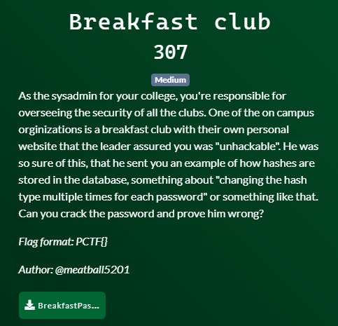

# Patriot CTF | Crypto | Breakfast Club

by h04x

### Challenge Description 

Downloadable File:
[BreakfastPasswords.txt](BreakfastPasswords.txt)

#### Decrypting the Hashes

We're given a file full of different hashes and each hash is equal to one character of the flag.

We can just use a script that Bruteforces every hash.

[Script](./solve_Breakfast.py)

`FLAG: PCTF{H@5H_8R0WNS}`