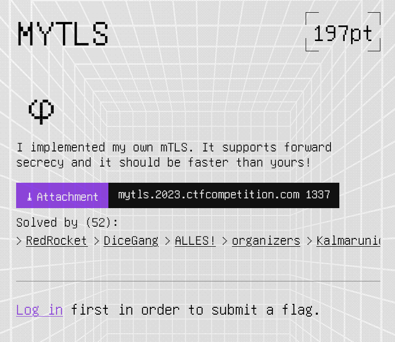

# Example Write Up

By whoever authored this write-up

### Challenge Text

Paste a screenshot of or copy and paste the challenge text. This introduces the reader to the challenge of getting them in the same mindset as you while solving. 



Keeping all your images and other assets in their own folders is much cleaner. 

# Table of Contents - Optional, but MDAIO can help with this.

- [Example Write Up](#example-write-up)
    - [Challenge Text](#challenge-text)
- [Table of Contents - Optional, but MDAIO can help with this.](#table-of-contents---optional-but-mdaio-can-help-with-this)
- [Describe Your Thought Processes](#describe-your-thought-processes)
    - [1. First Heading](#1-first-heading)
    - [2. Second Heading](#2-second-heading)
      - [2.1 Sub-Heading](#21-sub-heading)
- [Move on to your main exploit or solutions here.](#move-on-to-your-main-exploit-or-solutions-here)
    - [1. Structure this the same as above](#1-structure-this-the-same-as-above)
      - [1.1 It helps make things easy to follow.](#11-it-helps-make-things-easy-to-follow)
- [Getting the Flag](#getting-the-flag)
    - [1. If it makes sense, bring the "final attack" down to the bottom to emphasize that *this* was the solution.](#1-if-it-makes-sense-bring-the-final-attack-down-to-the-bottom-to-emphasize-that-this-was-the-solution)
    - [2. The flag](#2-the-flag)


# Describe Your Thought Processes

Give a quick primer on what started your path to success; you can include what did and didn't work. Any grand ideas or existing knowledge that lead you to the eventual solution. 

- [ ] You can include your goals.
- [ ] What worked. 
- [ ] Where your knowledge gaps were. 
- [ ] What you learned.

### 1. First Heading 

Keep it organized by putting the various phases of your solution under headings and sub-headings. 

[Mind your Markdown](https://www.markdownguide.org/extended-syntax/) It dramatically improves the professionalism of your write-up.

VSCode extensions like Markdown All in One (MDAIO) can help write a markdown document. 

### 2. Second Heading 

An example could be Researching the encryption or algorithms the challenge used here.

> Include images, links, and references. 
> The right-angle bracket is how you "quote" something. 

If you used any tools, put them here as well. 

#### 2.1 Sub-Heading

Then, include how YOU used that research. 

Try to include any scripts or commands you used as well. This doc is intended to teach you, teach the reader, and improve your technical writing skills. 

# Move on to your main exploit or solutions here. 

### 1. Structure this the same as above

```bash
$ The triple backticks allow you to "fence" code blocks. 
$ As well as tell MD what language it should highlight as.
$ Remember, images, scripts, and commands!
```

#### 1.1 It helps make things easy to follow. 

# Getting the Flag

### 1. If it makes sense, bring the "final attack" down to the bottom to emphasize that *this* was the solution. 

### 2. The flag

Try to post the flag using `backticks.`
