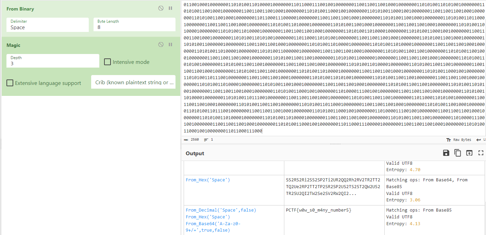

# Patriot CTF | Crypto | Multi-numeral

by h04x

### Challenge Description 

Downloadable file:
[Challenge.txt](./Challenge.txt)

#### Decoding the String

I just used Cyberchef to decode the Binary and then used Cyberchef's magic function to do the rest and that gives us the flag:

`FLAG: PCTF{w0w_s0_m4ny_number5}`