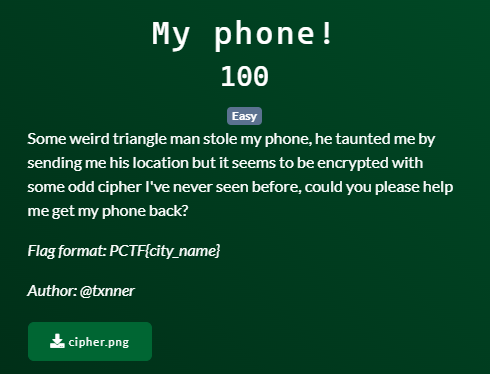
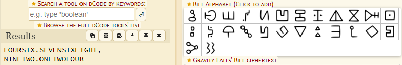

# Patriot CTF | Crypto | My Phone!

by h04x

### Challenge Description 

Downloadable file:
[cipher.png](./cipher.png)

#### Analyzing the Cipher

Looking online for a Cipher that looks similar to the one we got i found this:

[Gravity Falls Bill Cipher](https://www.dcode.fr/gravity-falls-bill-cipher)

A reference to Gravity Falls!
So let's decode it.

#### Decoding the Cipher

When decoding the Cipher we get this:

46.768,-92.124

#### Getting the Flag

The description of the Challenge tells us that we have to find a City, so it looks like the numbers we got are GPS coordinats.
Pasting them into Google Maps reveals the City we're looking for:
Duluth

And here is our flag:

`FLAG: PCTF{Duluth}`
