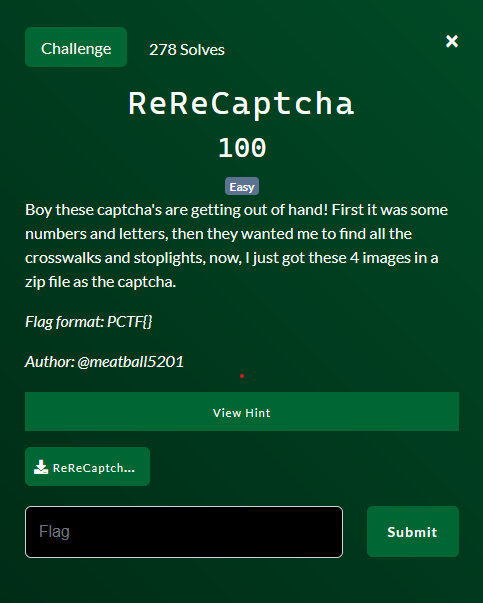

# ReReCaptcha

By lyu3e

### Challenge Description

#### Hint
Rivest, Shamir, and Adleman love this challenge

Downloadable File:
[ReReCaptcha.zip](ReReCaptcha.zip)

### 1. Obtain Numerics for RSA
In the zip file, we have CT (ciphertext), E (public exponent), P and Q (Prime Numbers) in the png images, which is pretty straighforward for RSA. 

### 2. Calculate and Convert to Text
Once we have these numerical components, we can use a [script](solve.py) to solve the RSA encryption. This script will help us to calculate the plaintext message 'm,' which can then be converted to text to reveal the flag.

## Flag
PCTF{I_H0P3_U_U53D_0CR!}
