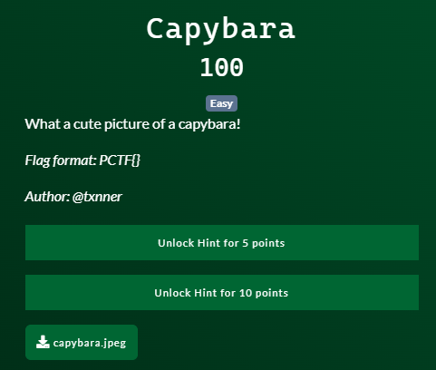
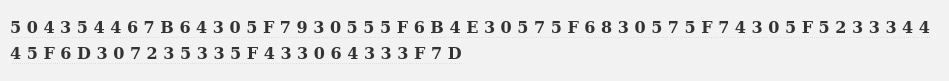
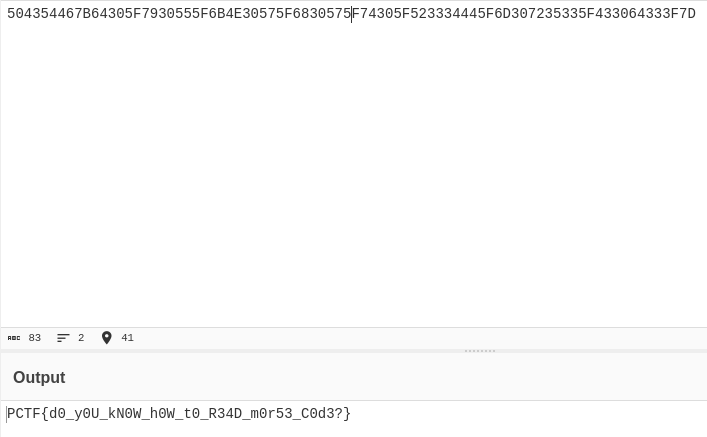

# Patriot CTF | Forensics | Capybara

### Challenge Description 



Downloadable file:
[capybara.jpeg](./cypybara.jpeg)

#### Analyzing the Files

Since it's a .jpeg my first instinct is to run steghide.
Steghide reveals that there is a file hidden inside it!! 
But we need a passphrase.
So let's move to the next tool we could try.

#### Revealing the hidden file

After steghide kinda failed i ran ```binwalk -e capybara-jpeg``` on the file and we actually get a [file](./audio.wav)!

[steghide](./binwalk.png)

#### Decoding the Morse Code

The extracted file seems to be an audio file with a morse code inside of it.
I just used an online audio to text morse converter and we get this:



#### Getting the flag

This looks like hex to me so i'll just use cyberchef to decode it and we get:



And here is our flag:

`FLAG: PCTF{d0_y0U_kN0W_h0W_t0_R34D_m0r53_C0d3?}`