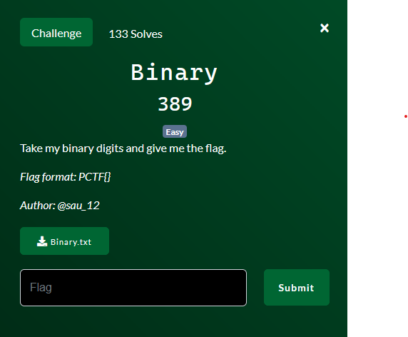

# Binary

By lyu3e

### Challenge Description

Downloadable File:
[Binary.txt](Binary.txt)

### Identify and Decrypt
The binary code was identified using a [Cipher Identifier](https://www.dcode.fr/cipher-identifier). The top result revealed that the binary code was written in the Spoon programming language, which composed of only 0 and 1. By interpreting this binary code, we were able to obtain the flag.

## Flag
PCTF{Sp00N_F33d_M3_11191}
