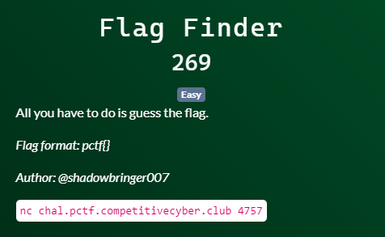

# Patriot CTF | Misc | Flag Finder

by h04x

### Challenge Description 

#### Analyzing the netcat connection

When connecting to the host it asks us for the Flag.
After trying some inputs we find out that the Flag must be 19 characters long so we just write a little script that bruteforces every character:

[script](script.py)

`FLAG: pctf{Tim3ingI8N3at}`