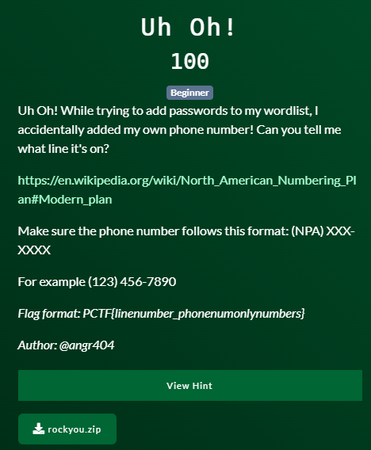

# Patriot CTF | Misc | Uh oh!

by h04x

### Challenge Description 



Downloadable file:
[rockyou.zip](./rockyou.zip)

#### Getting the Phonenumber

I used this command to get the phonenumber and it's line number:
```
grep -E "^[(][0-9]{3}[)][[:space:]][0-9]{3}[-][0-9]{4,6}$" -n rockyou.txt
```

#### Entering the Flag

7731484:(404) 303-7283

This is the Phonenumber we've been searching for so let's "translate" this into flag format

`FLAG: PCTF{7731484_4043037283}`