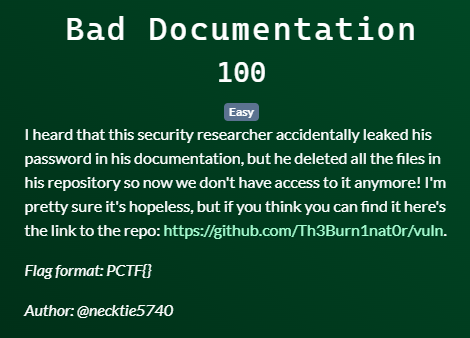

# Patriot CTF | OSINT | Bad Documentation

by h04x

### Challenge Description 

#### Finding the flag

Look at the deleted files (under commits) and look at the image. Basic authentication is literally just base64, if you decode this: YWRtaW46UENURntOMF9jMEQzJ3NfMlZlUnlfUjNhTGxZX0cwbjN9 you get admin:PCTF{N0_c0D3's_2VeRy_R3aLlY_G0n3}.

`FLAG: PCTF{N0_c0D3's_2VeRy_R3aLlY_G0n3}`