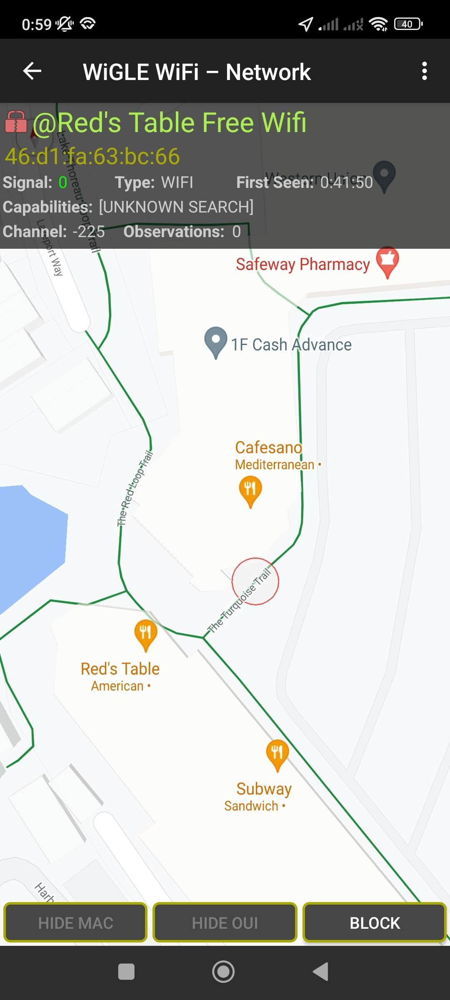

## Problem Description
We received a notice from our company's EDR software that a laptop was attacked while the employee was working from home (WFH). The employee claims they were at home during the attack, but we suspect they were using public Wi-Fi. Our EDR software captured the BSSID (46:D1:FA:63:BC:66) of the Wi-Fi network before it got disconnected, but not the SSID. Can we find the network they were connected to?

## Solution

1. Copy the BSSID: `46:D1:FA:63:BC:66`

2. Go to [wigle.net](https://wigle.net/) (You can also download the app if you're using a mobile device).

3. Sign up for an account (The sign-up process takes only 60 seconds and does not require email confirmation).

4. Paste the BSSID in the BSSID field (located under the SSID field).

5. Perform a search using this information.

6. You will be redirected to a result that shows the SSID associated with the BSSID: **@Red's Table Free Wifi**.

 You've found the SSID! The flag for this challenge is: `PCTF{@Red's_Table_Free_Wifi}`.

 