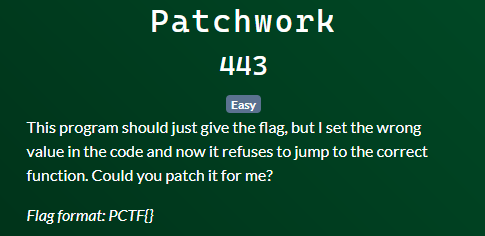
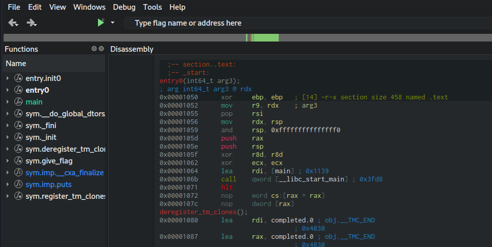
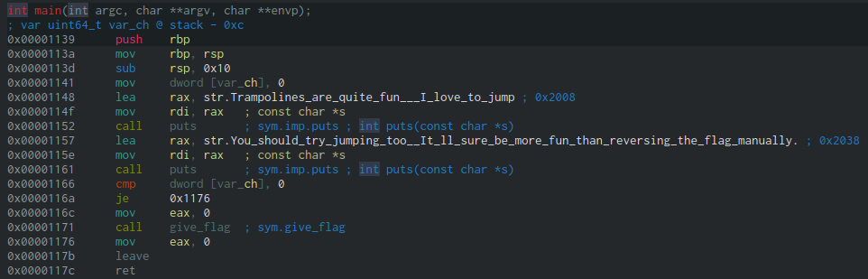
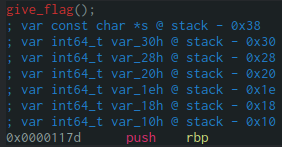
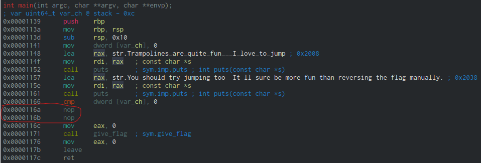

# Patchwork
By KiARC (aka Rosy)
### Challenge Text

# Table of Contents
- [Patchwork](#patchwork)
    - [Challenge Text](#challenge-text)
- [Table of Contents](#table-of-contents)
- [Thought Processes](#thought-processes)
    - [1. Priorities](#1-priorities)
    - [2. Strategy Ideas](#2-strategy-ideas)
      - [2.1 The Clue](#21-the-clue)
- [The Exploit](#the-exploit)
    - [1. Searching For Our Target](#1-searching-for-our-target)
- [Getting the Flag](#getting-the-flag)
# Thought Processes
### 1. Priorities 
- #1 priority is locating the flag in the binary, this is rev after all
- #2 priority is figuring out how exactly the binary returns the flag, might make our jobs easier (it did) 
### 2. Strategy Ideas 
- Use Cutter! Faster and more intuitive than Ghidra, and has more features than the free version of IDA
  - It uses `radare2` in the background which is awesome
  - To install: `sudo apt install rizin-cutter`
  - Highly recommend installing the other `rizin-*` packages as well
- Might sound obvious but seriously examine any output you get from the binary when first running it, there's always clues 
#### 2.1 The Clue
In this case, when I ran the binary right off the bat, I got the following (hilariously useful) output:
```
$ ./patchwork
Trampolines are quite fun!; I love to jump! 
You should try jumping too! It'll sure be more fun than reversing the flag manually.
```
That pretty much tells us all we need to know: We need to use jump instructions to get the flag.
# The Exploit 
### 1. Searching For Our Target
After making a backup of `patchwork` using `cp patchwork patchwork.bak` (ALWAYS make backups of any binary you're modifying), I launched cutter with `cutter patchwork`. There's no need to change anything in the startup menu, the defaults are fine. Now we can see the instructions in the file:

See that menu on the left? Those are the methods Cutter found. Let's check out `main` first, so we can see what is happening when we run the binary...



Hey! There's the text that it printed when we ran it! Isn't that neat? But let's ignore those and look a little further at index `0x00001171`. I wonder what that `give_flag` call does... Oh hey, Cutter found that in the sidebar too!



Well that isn't very helpful now is it. But let's look back at `main` for a moment. See the line at index `0x0000116a`, with the arrow next to it connecting to `0x00001176`? That jump call is making the program skip right over the call to `give_flag`! Rude. Let's fix that. First, select `File > Set mode > Cache mode`. Then right click on `0x0000116a` and navigate to `Edit > Nop Instruction`. Clicking on that will transform it into this:



The `je` has been replaced with a pair of `nop`s! A `nop` is exactly what it sounds like: no-op(eration). It does nothing. Now that the jump is gone, `give_flag` will get called! Hit `File > Commit changes` to write your changes to the binary, and close Cutter. Hit `Discard` when it asks about saving the project: We don't need to do any more RE work at this point.
# Getting the Flag
Now that you're back in the shell, run `./patchwork`. There's your flag:
```
$ ./patchwork   
Trampolines are quite fun!; I love to jump! 
You should try jumping too! It'll sure be more fun than reversing the flag manually.
PCTF{JuMp_uP_4nd_g3t_d0Wn}
```