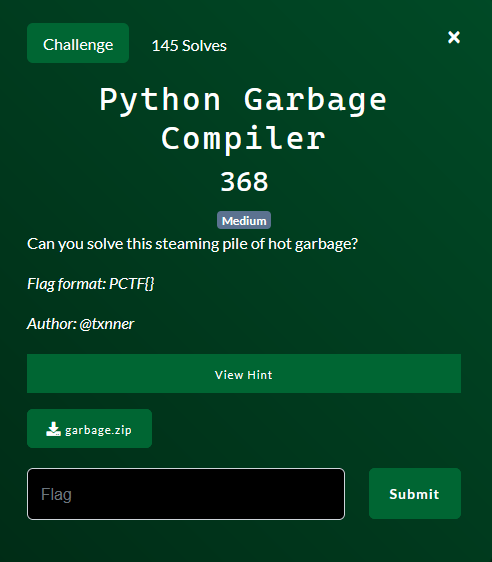

# Python Garbage Compiler

By lyu3e

### Challenge Description



#### Hint
Sorry

Downloadable File:
[garbage.zip](garbage.zip)

### 1. Remove Comments and Clean Up Code
The hint does not provide any value except that the code is hard to read.
The python code was filled up with a lot of unnecessary comments and code. So I clean it up. Example:
```python
    flag = 'flag'.replace('flag', 'galf').replace('galf', '')   
    # flag = ''
    t = "++++++++++[>+>+++>+++++++>++++++++++<<<<-]>>>>++.++++++.-----------.++++++."[-15:(7*9)].strip('-')
    # t = ''
```     

### 2. Decrypt the Output
There are 4 parts in encrypting the flag (entry->stage1->stage2->finalstage).  We will reverse the order of encryption steps for the flag decryption process to effectively test the code. To verify the accuracy of decryption, we can encrypt the decrypted output and check if it matches the original output.

Using this [script](solve.py), we are able to obtain the flag.

## Flag
PCTF{H0w_D1d_y0U_br34k_my_1337_c0de?}
